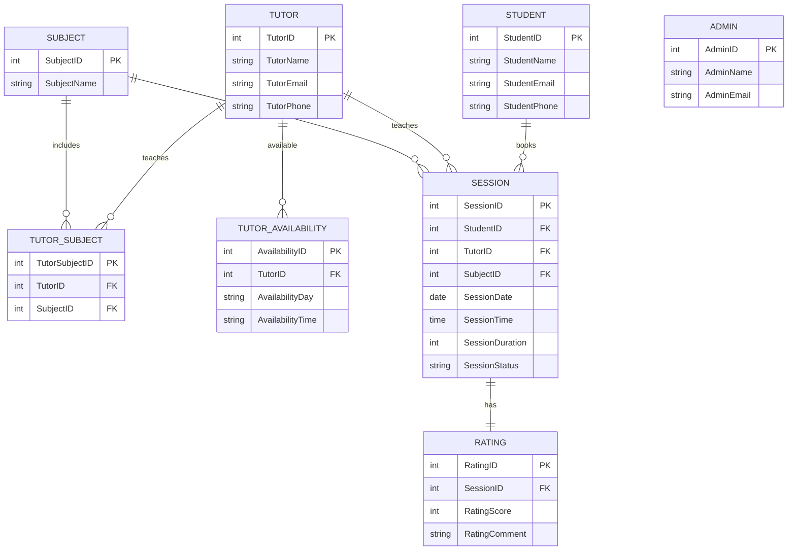

# DATABASE SYSTEMS PROJECT  
## PART B: NORMALIZATION

Project: **Peer Tutoring Platform**

---

# Part B-1. Identification of Relations and Dependencies [3 marks]

## Initial Unnormalized Relation (UNF)

Based on the system requirements, the initial unnormalized relation is:

```
TutoringRecord(
StudentID, StudentName, StudentEmail, StudentPhone,
TutorID, TutorName, TutorEmail, TutorPhone,
{SubjectID, SubjectName},
{AvailabilityDay, AvailabilityTime},
SessionID, SessionDate, SessionTime, SessionDuration, SessionStatus,
RatingScore, RatingComment,
AdminID, AdminName, AdminEmail
)
```

### Multivalued Attributes

| Attribute | Explanation |
|---|---|
| `{SubjectID, SubjectName}` | A tutor can teach multiple subjects |
| `{AvailabilityDay, AvailabilityTime}` | A tutor can have multiple availability slots |

---

## Functional Dependencies

```
StudentID → StudentName, StudentEmail, StudentPhone
TutorID → TutorName, TutorEmail, TutorPhone
SubjectID → SubjectName
SessionID → SessionDate, SessionTime, SessionDuration, SessionStatus, StudentID, TutorID, SubjectID
SessionID → RatingScore, RatingComment
AdminID → AdminName, AdminEmail
```

---

# Part B-2. Normalization Steps

## Step 1: First Normal Form (1NF)

Requirements of **1NF**:

- Remove repeating groups
- Ensure attributes are atomic
- Remove multivalued attributes

### Transformations Performed

- `{SubjectID, SubjectName}` extracted into **Subject**
- `{AvailabilityDay, AvailabilityTime}` extracted into **TutorAvailability**
- All attributes converted to atomic values

### Relations After 1NF

```
Student(StudentID, StudentName, StudentEmail, StudentPhone)

Tutor(TutorID, TutorName, TutorEmail, TutorPhone)

Subject(SubjectID, SubjectName)

TutorAvailability(AvailabilityID, TutorID, AvailabilityDay, AvailabilityTime)

Session(SessionID, SessionDate, SessionTime, SessionDuration, SessionStatus,
StudentID, TutorID, SubjectID)

Rating(RatingID, SessionID, RatingScore, RatingComment)

Admin(AdminID, AdminName, AdminEmail)
```

---

## Step 2: Second Normal Form (2NF)

**2NF requirement:**  
No partial dependencies.

Analysis:

- Each table has a **single primary key**
- All attributes depend fully on the primary key
- No composite keys exist

Therefore:

✅ All relations satisfy **Second Normal Form (2NF)**.

---

## Step 3: Third Normal Form (3NF)

**3NF requirement:**  
Remove **transitive dependencies**.

| Table | Dependency Analysis |
|------|------|
| Student | Attributes depend only on StudentID |
| Tutor | Attributes depend only on TutorID |
| Subject | SubjectName depends only on SubjectID |
| Session | Attributes depend only on SessionID |
| Rating | RatingScore and RatingComment depend only on RatingID |

Therefore:

✅ No transitive dependencies exist.  
All relations satisfy **Third Normal Form (3NF)**.

---

# Part B-3. Final Relations in 3NF [3 marks]

| Table | Attributes |
|------|------|
| Student | **StudentID (PK)**, StudentName, StudentEmail, StudentPhone |
| Tutor | **TutorID (PK)**, TutorName, TutorEmail, TutorPhone |
| Subject | **SubjectID (PK)**, SubjectName |
| TutorSubject | **TutorSubjectID (PK)**, TutorID (FK), SubjectID (FK) |
| TutorAvailability | **AvailabilityID (PK)**, TutorID (FK), AvailabilityDay, AvailabilityTime |
| Session | **SessionID (PK)**, StudentID (FK), TutorID (FK), SubjectID (FK), SessionDate, SessionTime, SessionDuration, SessionStatus |
| Rating | **RatingID (PK)**, SessionID (FK), RatingScore, RatingComment |
| Admin | **AdminID (PK)**, AdminName, AdminEmail |

---

# Entity Relationship Diagram (ERD)



---

# Final Justification

The schema satisfies **Third Normal Form (3NF)** because:

1. **Atomic attributes (1NF)**  
   All attributes contain indivisible values.

2. **Full functional dependency (2NF)**  
   Every non-key attribute depends entirely on the primary key.

3. **No transitive dependencies (3NF)**  
   Non-key attributes do not determine other non-key attributes.

Therefore, the database design is **fully normalized to 3NF**.